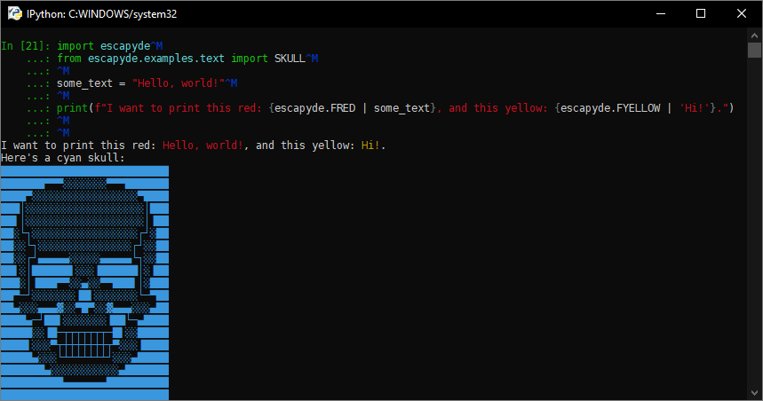

# escapyde

Yet another ANSI escape sequence library for Python - now modernised!

## Installation

The package is readily available on PyPI. There are no dependencies, but Python 3.6 or newer is required.

On Windows:

```sh
py -m pip install escapyde
```

On other platforms:

```sh
pip3 install escapyde
```

## Usage

```py
import escapyde
from escapyde.examples.text import SKULL

some_text = "Hello, world!"

print(f"I want to print this red: {escapyde.FRED | some_text}, and this yellow: {escapyde.FYELLOW | 'Hi!'}.")

print(f"Here's a cyan skull:\n{escapyde.FCYAN | SKULL}")
```

As can be seen, the example works perfectly fine:


